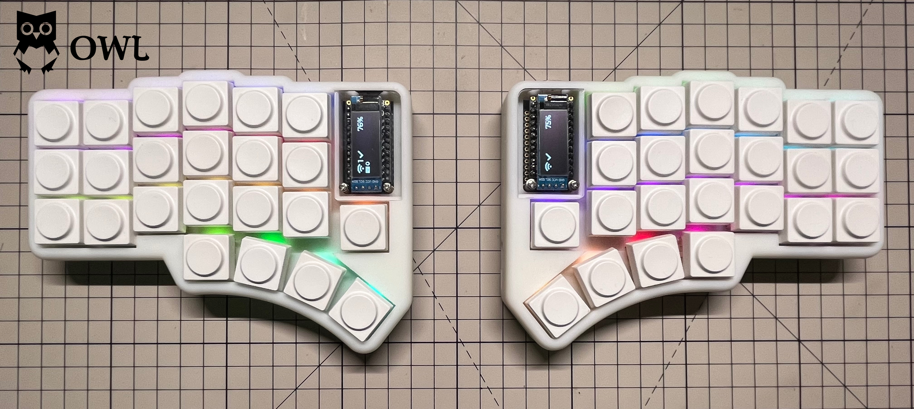

# Owl
**Owl**, an acronym for **Orthogonal Wireless Layout**, combines the ergonomic freedom of wireless connectivity with a split keyboard design influenced by [Lily58](https://github.com/kata0510/Lily58), [Corne](https://github.com/foostan/crkbd), [Sofle](https://github.com/josefadamcik/SofleKeyboard) and [Torn](https://github.com/rtitmuss/torn) keyboards.

## Feature
- Owl uses **Pro Micro** Interconnect small controller board, which means easy for Maintenance and replacemen. And supports a variety of boards including [nice!nano](https://nicekeyboards.com/nice-nano) and [nrfmicro](https://github.com/joric/nrfmicro/) (I **have not tried yet**, but theoretically feasible).
- Low latency wireless, supported by [ZMK](https://github.com/zmkfirmware/zmk).
- Gorgeous **RGB** lighting effects.
- Two multifunctional **OLED** screens that can display keyboard battery level and connection status.
- Split keyboard conforms to **ergonomics**.
- A total of two PCBs compatible with Cherry MX switches, Kailh choc Low Profile switches, and Gateron Low Profile switches.
- **Double-sided** PCB design, both sides are universal.
## Building your own
Detailed [Build Guide](https://nand.fun/en/series/owl-split-keyboard/).

Please make sure you can get the ability to build the keyboard:
- Soldering circuit components
- Circuit board production
- 3D printing
- Using GitHub action to build firmware
- Consulting documents carefully
## License

The Owl Keyboard is licensed under [Creative Commons Attribution-NonCommercial 4.0 International License](https://creativecommons.org/licenses/by-nc/4.0).

This PCB design may be freely reproduced, modified, and manufactured for personal use only. If you would like to use this design commercially please contact me at hza2002@foxmail.com to request permission.
## Thanks
I would like to express my sincere gratitude to the creators and contributors of various articles, repositories, and tutorials that greatly contributed to the development of the 'Owl' keyboard. 

These resources provided me with essential insights and knowledge throughout the development process. I am truly thankful for the open-source community's generosity and collaborative spirit."

Without their invaluable resources, this project would not have been possible. I encourage anyone interested in the details of this project to explore the following sources:
### PCB
- [Use KiCad to make PCB - zero-based KiCad Chinese tutorial](https://haipeng.me/2017/03/01/kicad-tutorial/)
- [Kicad advanced tutorial 1: new component](https://haipeng.me/2018/05/24/kicad_advanced_tutorial_1_new_component/)
- [Kicad advanced tutorial 2: new logo](https://haipeng.me/2018/07/11/kicad_advanced_tutorial_2_new_logo/)
- [Kicad advanced tutorial 3: mask opening](https://haipeng.me/2019/09/02/kicad-mask-opening/)
- [How to generate Gerber and Drill files in KiCad 7](https://jlcpcb.com/help/article/362-how-to-generate-gerber-and-drill-files-in-kicad-7)
- [How to generate the BOM and Centroid file from KiCAD](https://jlcpcb.com/help/article/81-How-to-generate-the-BOM-and-Centroid-file-from-KiCAD)
### Other Keyboard
I took inspiration from other keyboards I'd used or liked:
- [Torn](https://github.com/rtitmuss/torn) My first DIY keyboard, easy to build and robust to use. The reason of the Owl keyboard layout (basicly the same).
- [Corne](https://github.com/foostan/crkbd) Handsome and technological design, various styles of PCB provide important reference.
- [Sofle](https://github.com/josefadamcik/SofleKeyboard) Referenced some circuit design and component selection.
- [Lily58](https://github.com/kata0510/Lily58) Referenced some circuit design and component selection.
### helpful repo
- [key-switches.pretty](https://github.com/siderakb/key-switches.pretty) Very helpful. It contains various keyboard footprints and has exquisite instruction tables.
- [keyswitches.pretty](https://github.com/daprice/keyswitches.pretty) KiCAD footprint library for kailh choc and MX-style mechanical switches and their associated sockets.
- [Keebio-Parts.pretty](https://github.com/keebio/Keebio-Parts.pretty) Various KiCAD footprints for mechanical keyboard parts.
## Gallery

