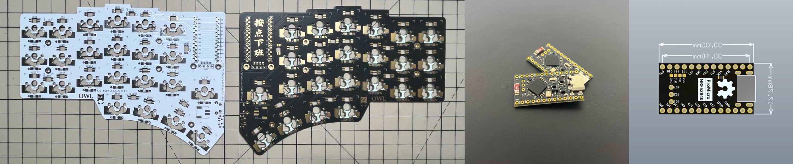
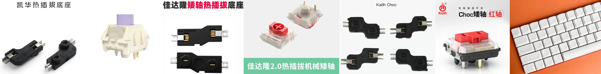
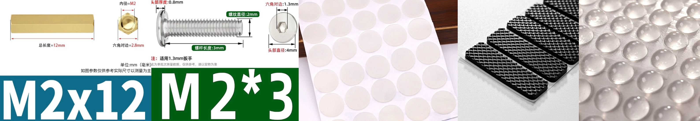
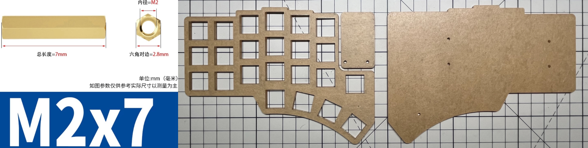
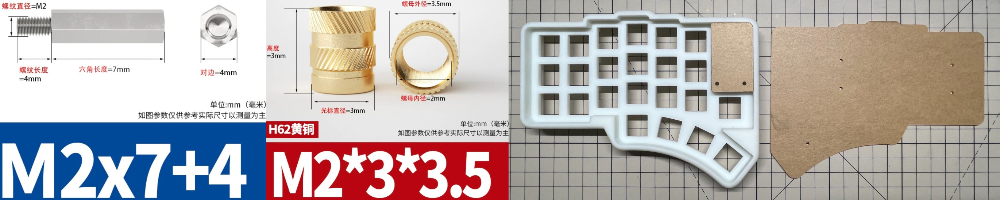

# Build Guide
This is the complete construction guide for the Owl keyboard, please read it carefully. If possible, please also refer to other split keyboard construction guides as reference. Please note that if you encounter any difficulties during the installation process, please fully utilize your **DIY abilities** and use various feasible parts. You are free to do so.
## Bill of materials
### Required (PCB)

| Name           | Count | Remarks                                                                              |
| :------------- | :---- | :----------------------------------------------------------------------------------- |
| PCB            | 2     | 1.6mm if use 3D printed case                                                         |
| ProMicro       | 2     | [nice!nano](https://nicekeyboards.com/nice-nano)                                     |
| Diodes         | 46    | SOD-123 or DO-35                                                                     |
| Reset switch   | 2     | 3\*6\*5                                                                              |
| Battery switch | 2     | MSK-1102-1.5H                                                                        |
| Battery socket | 2     | PH2.0 2P                                                                             |
| Battery        | 2     | 3.7V lithium (max size 40\*50\*70)                                                   |
| PCB sockets    | 46    | Compatible with MX and Gateron low profile, and Kailh choc if using choc version PCB |
| Key switches   | 46    | Only compatible with MX style                                                        |
| Keycaps        | 46    | 1u cap                                                                               |

### Optional
#### RGB and Oled

| Name         | Count | Remarks                                            |
| :----------- | :---- | :------------------------------------------------- |
| OLED         | 2     | 0.91 inches                                        |
| SK6812MINI-E | 58    | Install all lights as they are connected in series |

#### Case
##### General

| Name           | Count | Remarks                |
| :------------- | :---- | :--------------------- |
| Spacer M2 12mm | 4     | For OLED cover         |
| Screw M2       | 24    | At least 3mm           |
| Rubber feet    | ANY   | For anti-slip purposes |

##### Transparent-explorer

| Name          | Count | Remarks                      |
| :------------ | :---- | :--------------------------- |
| Top plate     | 2     | 1.5mm-4mm                    |
| Bottom plate  | 2     | At least 1.5mm               |
| OLED cover    | 2     | At least 1mm                 |
| Spacer M2 7mm | 10    | Between pcb and bottom plate |

##### 3D-printed

| Name                      | Count | Remarks                                 |
| :------------------------ | :---- | :-------------------------------------- |
| Spacer M2 7+4mm           | 10    | Between pcb and bottom plate            |
| Hot melt screw M2\*3\*3.5 | 10    | Used for integrating 3D printed case    |
| 3D-printed case        | 2     | Please select printing materials freely |
| OLED cover                | 2     | 2mm                                     |
| Bottom plate              | 2     | 2mm                                     |

## Assembly

## Firmware
This keyboard uses ZMK as firmware, please refer to my [zmk-config](https://github.com/hza2002/zmk-config) repository.

The method of flashing firmware is very simple. Just press the boot button twice quickly to enter boot mode, and the keyboard controller will appear on the computer like a USB flash drive. Drag and drop the firmware to update it.