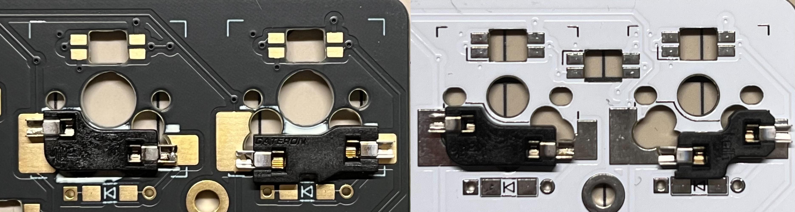
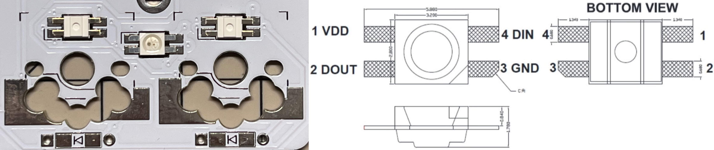
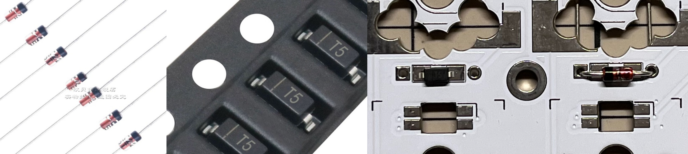
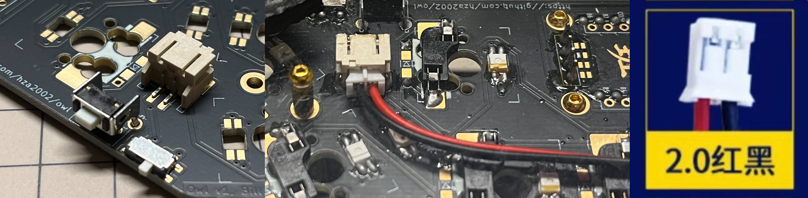
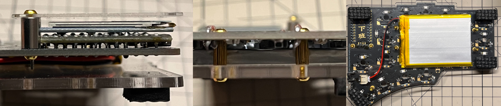

# Build Guide
This is the complete construction guide for the Owl keyboard, please read it carefully. If possible, please also refer to other split keyboard construction guides as reference. Please note that if you encounter any difficulties during the installation process, please fully utilize your **DIY abilities** and use various feasible parts. You are free to do so.
## Bill of materials
### Required (PCB)

| Name           | Count | Remarks                                                                              |
| :------------- | :---- | :----------------------------------------------------------------------------------- |
| PCB            | 2     | 1.6mm if use 3D printed case                                                         |
| ProMicro       | 2     | [nice!nano](https://nicekeyboards.com/nice-nano)                                     |
| Diodes         | 46    | SOD-123 or DO-35                                                                     |
| Reset switch   | 2     | 3\*6\*5                                                                              |
| Battery switch | 2     | MSK-1102-1.5H                                                                        |
| Battery socket | 2     | PH2.0 2P                                                                             |
| Battery        | 2     | 3.7V lithium (max size 40\*50\*70)                                                   |
| PCB sockets    | 46    | Compatible with MX and Gateron low profile, and Kailh choc if using choc version PCB |
| Key switches   | 46    | Only compatible with MX style                                                        |
| Keycaps        | 46    | 1u cap                                                                               |

### Optional
#### RGB and Oled

| Name         | Count | Remarks                                            |
| :----------- | :---- | :------------------------------------------------- |
| OLED         | 2     | 0.91 inches                                        |
| SK6812MINI-E | 58    | Install all lights as they are connected in series |

#### Case
##### General

| Name           | Count | Remarks                |
| :------------- | :---- | :--------------------- |
| Spacer M2 12mm | 4     | For OLED cover         |
| Screw M2       | 24    | At least 3mm           |
| Rubber feet    | ANY   | For anti-slip purposes |

##### Transparent-explorer

| Name          | Count | Remarks                      |
| :------------ | :---- | :--------------------------- |
| Top plate     | 2     | 1.5mm-4mm                    |
| Bottom plate  | 2     | At least 1.5mm               |
| OLED cover    | 2     | At least 1mm                 |
| Spacer M2 7mm | 10    | Between pcb and bottom plate |

##### 3D-printed

| Name                      | Count | Remarks                                 |
| :------------------------ | :---- | :-------------------------------------- |
| Spacer M2 7+4mm           | 10    | Between pcb and bottom plate            |
| Hot melt screw M2\*3\*3.5 | 10    | Used for integrating 3D printed case    |
| 3D-printed case        | 2     | Please select printing materials freely |
| OLED cover                | 2     | 2mm                                     |
| Bottom plate              | 2     | 2mm                                     |

## Assembly
### Switch socket
Please select the corresponding keyboard switch socket according to the selected PCB (**MX switch and Gateron low-profile switch for normal version, MX switch and Kailh low-profile switch for choc version**).

### RGB light
A single side needs 23 key lights and 6 bottom lights in series, so please install all or none at all. For the convenience of selection and manual soldering, we only use SK6812MINI-E. The position for installing the GND pin has been marked on the PCB. When installing, just pay attention to have the LED facing downwards and the bottom light facing upwards. **They are in opposite directions**.

### Diode
Each keyboard switch corresponds to a diode. You can freely choose between surface-mount diodes or through-hole diodes, and even install them on the front or back of the PCB (note that installing on the back **may conflict** with the case). In any case, **please make sure that the direction of the diode is correct**.

### Switch and Battery
The reset and boot switches, as well as the power socket, are very easy to solder. It is not necessary to elaborate here. It is worth noting that the protruding pins on the back of the straight plug switch should be polished and trimmed to avoid affecting the installation of the housing. **Please be careful to pay attention to the battery wire sequence**.

### Chip and Oled
Since the PCB is double-sided, you can install the chip on either side, whether it is directly soldered or connected with a socket. The position where the chip pins should be installed is marked on each side, be careful not to solder incorrectly.

**If you want to use 3D printed shell, be sure to follow the steps below!**

It is recommended to use the low-profile slot to install the chip on the front of the keyboard. Pay attention to installing the slot on the column marked on the PCB. When installing the chip, make sure that its back side (the flat side without components) faces up. Finally, when installing the OLED screen, please make sure they are installed tightly.
### Case
#### 3D-printed
First, install five hot-melt screws into the 3D printed case, then place the completed PCB inside, tighten the five screws, and finally install the back panel and front OLED acrylic.

#### transparent explorer
This case does not have much to pay attention to, only using m2 screws and two-stage screws for connection.

### Key
The final step is to install the keyboard switches and keycaps, just align them, very simple, please feel free to use your creativity to mix and match.

## Firmware
This keyboard uses ZMK as firmware, please refer to my [zmk-config](https://github.com/hza2002/zmk-config) repository.

The method of flashing firmware is very simple. Just press the boot button twice quickly to enter boot mode, and the keyboard controller will appear on the computer like a USB flash drive. Drag and drop the firmware to update it.